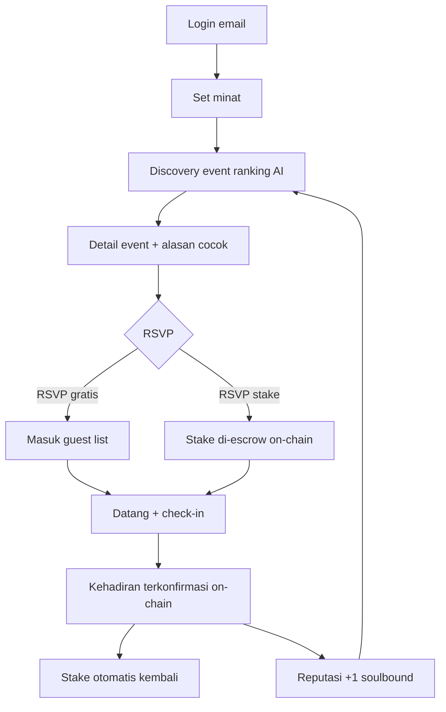
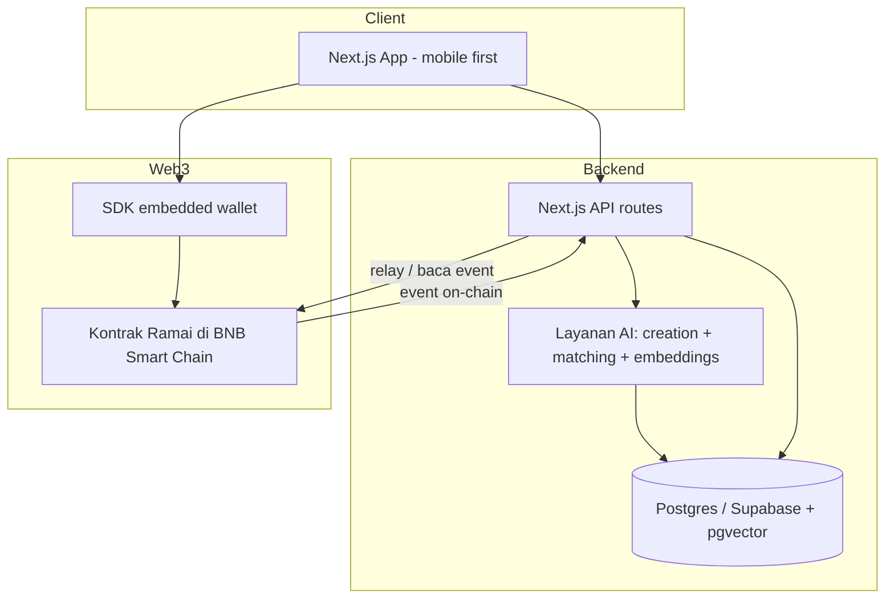

# Ramai

**Bikin event yang beneran keisi — dan yang RSVP-nya beneran dateng.**

Ramai adalah platform event consumer di mana AI mencocokkan event dengan peserta yang _tepat_, RSVP dengan _stake_ on-chain mengubah "mungkin datang" jadi komitmen nyata, dan setiap kehadiran menjadi reputasi yang portabel serta bisa diverifikasi. Dibangun untuk Indonesia Web3 Hackathon 2026 — track **Consumer Apps** — di atas BNB Smart Chain.

> ⚠️ **Deadline submission: 30 September 2026, 23:59 WIB.** Track: **Consumer Apps**. Smart contract wajib di BNB Smart Chain / opBNB (testnet diizinkan). Detail lengkap + compliance checklist di [docs/HACKATHON_REQUIREMENTS.md](./docs/HACKATHON_REQUIREMENTS.md). Item yang belum dikonfirmasi panitia ditandai `PERLU KONFIRMASI PANITIA` dan **tidak** dikarang.

📚 **Dokumentasi lengkap ada di folder [`docs/`](./docs):**

| Dokumen | Isi |
|---|---|
| [HACKATHON_REQUIREMENTS.md](./docs/HACKATHON_REQUIREMENTS.md) | Audit aturan resmi, requirement matrix, compliance checklist |
| [SUBMISSION_DRAFT.md](./docs/SUBMISSION_DRAFT.md) | Draft siap-tempel untuk form submission |
| [PRODUCT_SPEC.md](./docs/PRODUCT_SPEC.md) | Konsep, target user, fitur, MVP scope |
| [USER_FLOWS.md](./docs/USER_FLOWS.md) | Semua flow (onboarding, buat event, matching, RSVP, check-in, refund, reputasi, edge case) |
| [TECHNICAL_ARCHITECTURE.md](./docs/TECHNICAL_ARCHITECTURE.md) | Arsitektur sistem, tech stack, alur data |
| [SMART_CONTRACT_SPEC.md](./docs/SMART_CONTRACT_SPEC.md) | Spesifikasi kontrak, fungsi, event, akses |
| [AI_ARCHITECTURE.md](./docs/AI_ARCHITECTURE.md) | Arsitektur AI: creation + matching |
| [DATABASE_SCHEMA.md](./docs/DATABASE_SCHEMA.md) | Skema DB, ERD, index, privasi |
| [SECURITY.md](./docs/SECURITY.md) | Audit risiko + mitigasi |
| [DEVELOPMENT_ROADMAP.md](./docs/DEVELOPMENT_ROADMAP.md) | Rencana build per fase |
| [DEMO_SCRIPT.md](./docs/DEMO_SCRIPT.md) | Naskah demo ≤5 menit |

---

## Masalah

Bikin event punya dua bagian sulit, dan tool yang ada cuma menyelesaikan yang gampang.

- **Organizer bisa bikin event dalam hitungan menit — tapi susah mengisinya.** Mereka sebar link ke WhatsApp, Instagram, Telegram, lalu berharap orang yang tepat melihatnya. Tidak ada sistem yang memunculkan event ke orang yang memang mau event seperti itu.
- **Peserta tenggelam dalam noise.** Discovery itu antara feed algoritmik yang dioptimasi buat scrolling, atau grup chat yang harus sudah ikut duluan. Menemukan event yang benar-benar cocok dengan minat dan jadwal = untung-untungan.
- **RSVP tidak berarti apa-apa.** Orang tap "Hadir" secara gratis lalu tidak datang. Organizer over-invite buat kompensasi, kualitas turun buat semua orang. No-show adalah alasan nomor satu event komunitas kecil mati.
- **Tidak ada yang tersisa setelah event.** Setelah selesai tidak ada trust layer: tidak ada bukti kamu benar-benar hadir, tidak ada reputasi yang bisa dipercaya organizer, tidak ada loyalty yang terbawa ke event berikutnya.

Web3 bisa memperbaiki masalah trust dan komitmen — tapi produk event Web3 selama ini menuntut wallet, gas, dan istilah teknis yang ditolak user biasa.

## Solusi

Ramai menyerang masalah _peserta yang tepat_ dari hulu ke hilir:

1. **AI bikin event.** Organizer deskripsikan event dalam satu kalimat. Ramai menyusun judul, deskripsi, kategori, target audiens, dan copy undangan.
2. **AI mencocokkan peserta.** Ramai me-ranking event terhadap profil minat user nyata dan memunculkannya ke orang yang paling mungkin hadir — lengkap dengan alasan "kenapa ini cocok buat kamu".
3. **RSVP komitmen on-chain.** RSVP bisa membawa **stake kecil yang bisa dikembalikan**. Datang → otomatis balik. No-show → hangus (dikembalikan ke organizer atau pool). Ini bagian yang **tidak bisa** dilakukan database biasa secara trustless — dana ditahan kontrak, bukan janji orang.
4. **Kehadiran terverifikasi → reputasi.** Check-in dikonfirmasi on-chain dan menambah **reputasi kehadiran soulbound** yang dibawa user lintas organizer. Reputasi tinggi = match lebih baik + kepercayaan organizer.

Blockchain **tak terlihat sampai ia memberi nilai**: user login pakai email, dapat embedded wallet otomatis, dan tak pernah lihat gas atau seed phrase untuk alur inti.

## Kenapa Penting

Core loop-nya menggulung (compounding). Setiap check-in jujur membuat match berikutnya lebih baik dan guest list tiap organizer lebih tepercaya — aset data & trust yang tak bisa ditiru app event terpusat, karena catatan kehadiran mereka tidak portabel, tidak bisa diverifikasi, dan tidak dimiliki user.

## Kenapa Web3?

Hanya dua mekanisme yang benar-benar butuh blockchain. Sisanya sengaja off-chain.

| Fitur | Kenapa harus on-chain | Kenapa database tidak cukup |
|---|---|---|
| **Escrow stake / komitmen RSVP** | Dana harus ditahan & dilepas oleh aturan yang tak bisa diintervensi satu pihak. | Saldo di DB itu IOU yang dikontrol platform; user tak bisa verifikasi atau tarik kembali secara trustless. |
| **Reputasi kehadiran (soulbound)** | Harus portabel lintas organizer & bisa diverifikasi independen, dimiliki user. | Skor di DB hidup di satu perusahaan dan hilang kalau platform tutup; organizer tak bisa audit. |

Sisanya — profil, minat, index pencarian, embedding AI, media event — tetap **off-chain** karena menaruhnya on-chain hanya menambah biaya, latensi, dan risiko privasi tanpa manfaat buat user.

## Kenapa BNB Chain?

- **Fee rendah bikin micro-stake masuk akal.** Stake RSVP kecil yang refundable hanya jalan sebagai produk consumer kalau biaya transaksi mendekati nol. BNB Smart Chain (dan opBNB yang lebih murah) menjaga ekonomi stake + check-in tetap sehat.
- **Tooling EVM matang** (Foundry, viem/wagmi, SDK embedded wallet) → lapisan on-chain kecil dan bisa diaudit dalam waktu hackathon.
- **Finalitas cepat** supaya check-in terkonfirmasi saat event berlangsung, bukan setelahnya.

> ✅ **Terkonfirmasi:** aturan resmi mengizinkan deploy di BNB Smart Chain **atau opBNB, mainnet ATAU testnet**. Blueprint menargetkan **BSC Testnet** untuk demo.

## AI

AI di sini mesin nyata, bukan chatbot tempelan.

1. **Asisten Bikin Event** — niat organizer (satu kalimat, mis. _"futsal santai di Yogyakarta buat pemula, Sabtu sore"_) → objek event terstruktur + copy undangan persuasif + saran kategori & audiens.
2. **Pencocokan Peserta** — profil minat user di-embed; event di-embed; matching me-ranking kandidat dan mengembalikan **alasan yang bisa dijelaskan** per peserta ("Kamu suka olahraga santai dan biasanya kosong Sabtu"). Explainability ini sengaja — membangun trust dan jadi beat demo yang kuat.
3. **(Opsional) Gerbang anti-spam / kualitas** — menandai event asal-asalan atau duplikat sebelum masuk discovery.

AI makin baik seiring data kehadiran tumbuh (reputasi dan turnout nyata masuk kembali ke ranking), menutup loop dengan lapisan on-chain.

## Fitur

- Bikin event dari satu kalimat lewat AI
- Discovery berbasis minat, dengan alasan yang bisa dijelaskan
- Login email dengan embedded wallet otomatis (tanpa seed phrase untuk alur inti)
- Stake RSVP on-chain opsional & refundable
- Check-in via QR / kode dengan konfirmasi kehadiran on-chain
- Reputasi kehadiran soulbound yang portabel
- Dashboard organizer: guest list, check-in, hitung no-show

## Alur Pengguna (ringkas)

> Detail lengkap semua alur + edge case ada di [docs/USER_FLOWS.md](./docs/USER_FLOWS.md).



## Arsitektur



**Prinsip:** off-chain menangani kerja berat, privat, dan cepat (profil, pencarian, AI). On-chain hanya menangani yang butuh trust (escrow stake, kehadiran, reputasi). Backend meng-index event on-chain kembali ke Postgres supaya UI tetap cepat.

## Smart Contracts

Dua kontrak ramping (sengaja minimal agar bisa diaudit dalam scope hackathon). Detail penuh di [docs/SMART_CONTRACT_SPEC.md](./docs/SMART_CONTRACT_SPEC.md).

- **`RamaiEvents`** — registry event + escrow stake RSVP + check-in.
- **`RamaiReputation`** — reputasi kehadiran soulbound & non-transferable (gaya ERC-5192).

**Tidak pernah on-chain:** data profil pribadi, vektor minat, embedding AI, deskripsi/media event, lokasi presisi, kontak. Hanya hash/ID dan state komitmen + kehadiran minimal yang on-chain.

## Tech Stack

| Lapisan | Pilihan | Alasan |
|---|---|---|
| Frontend | Next.js + React + Tailwind + shadcn/ui | Cepat dibangun, mobile-first, UI consumer bersih |
| Wallet / Auth | SDK embedded wallet (login email) | User non-crypto dapat wallet tanpa seed phrase |
| Backend | Next.js API routes | Satu codebase, cepat rilis |
| Database | Postgres / Supabase + `pgvector` | Data relasional + embedding minat/event dalam satu tempat |
| AI | LLM (bikin event + matching) + embeddings | AI fungsional nyata, bukan chatbot |
| Chain | BNB Smart Chain (Testnet untuk demo; opBNB opsional) | Fee rendah untuk micro-stake; tooling EVM |
| Kontrak | Solidity + Foundry | Loop test + deploy cepat |
| Chain client | viem + wagmi | Baca/tulis type-safe, integrasi wallet |

Sengaja **tidak** dipakai: token custom, DAO, NFT marketplace, multi-chain, chat/social feed on-chain. Lihat [Batasan yang Diketahui](#batasan-yang-diketahui).

## Memulai (Getting Started)

> Tahap blueprint — perintah di bawah adalah layout yang dituju, belum semua tersambung.

### Prasyarat
- Node.js 20+
- pnpm
- Foundry (`forge`, `cast`)
- RPC BNB Smart Chain Testnet + wallet test terisi ([faucet tBNB](https://www.bnbchain.org/en/testnet-faucet))

### Environment Variables

Buat `.env.local`:

```bash
# Frontend / backend
DATABASE_URL=postgres://...
NEXT_PUBLIC_APP_URL=http://localhost:3000

# Embedded wallet
NEXT_PUBLIC_WALLET_APP_ID=...

# Chain
NEXT_PUBLIC_CHAIN_ID=97            # BSC Testnet
BSC_TESTNET_RPC_URL=https://data-seed-prebsc-1-s1.bnbchain.org:8545
DEPLOYER_PRIVATE_KEY=...           # deploy saja, jangan commit
NEXT_PUBLIC_RAMAI_EVENTS_ADDRESS=
NEXT_PUBLIC_RAMAI_REPUTATION_ADDRESS=

# AI
LLM_API_KEY=...
EMBEDDINGS_API_KEY=...
```

### Development Lokal

```bash
pnpm install
pnpm db:migrate
pnpm dev
```

### Deploy Smart Contract

```bash
cd contracts
forge build
forge test
forge script script/Deploy.s.sol \
  --rpc-url $BSC_TESTNET_RPC_URL \
  --private-key $DEPLOYER_PRIVATE_KEY \
  --broadcast
```
Salin alamat hasil deploy ke `.env.local`.

### Testing

```bash
forge test            # kontrak
pnpm test             # app
```

## Demo

✅ **Terkonfirmasi:** video demo ≤5 menit (disarankan). Format/hosting `PERLU KONFIRMASI PANITIA`. Naskah lengkap di [docs/DEMO_SCRIPT.md](./docs/DEMO_SCRIPT.md). Alur inti ≤5 menit:

1. Organizer ketik satu kalimat → AI bangun event secara live.
2. Peserta buka app → lihat event tersebut ranking #1 dengan "kenapa cocok buat kamu".
3. Peserta RSVP dengan stake refundable (satu tap, tanpa prompt gas).
4. Di "pintu", organizer check-in → kehadiran terkonfirmasi on-chain.
5. Stake balik otomatis; reputasi naik. **Momen aha.**

Link demo: _TBD_

## Alamat Kontrak

| Kontrak | Jaringan | Alamat |
|---|---|---|
| `RamaiEvents` | BSC Testnet | Belum di-deploy |
| `RamaiReputation` | BSC Testnet | Belum di-deploy |

## Screenshot

_Menyusul._

## Roadmap

- **Fase 1** — Fondasi: skema, auth + embedded wallet, kerangka app
- **Fase 2** — Kontrak: `RamaiEvents` + `RamaiReputation`, tes Foundry
- **Fase 3** — Backend: CRUD event, indexer on-chain
- **Fase 4** — AI: asisten bikin event, embeddings, matching yang bisa dijelaskan
- **Fase 5** — Frontend: discovery, detail event, RSVP, dashboard organizer
- **Fase 6** — Integrasi: RSVP stake → check-in → refund → reputasi, end to end
- **Fase 7** — Testing + poles demo
- **Pasca-hackathon** — migrasi opBNB, relay gasless, reputasi organizer, referral

## Batasan yang Diketahui

- Trust check-in saat ini bertumpu pada tanda tangan organizer; produksi akan menambah konfirmasi sisi peserta (kode ber-geofence / check-in dua sisi).
- Reputasi berbasis jumlah kehadiran; scoring lebih kaya & sadar-decay menyusul.
- Ketahanan Sybil bertumpu pada email + stake, bukan proof identitas.
- Menargetkan BSC Testnet untuk demo; ekonomi mainnet belum di-tuning.
- Sengaja mengecualikan token, DAO, social feed on-chain, dan multi-chain — di luar scope by design, bukan kelupaan.

## Tim

_Placeholder — isi anggota, peran, dan kontak sebelum submission._

## Lisensi

MIT
