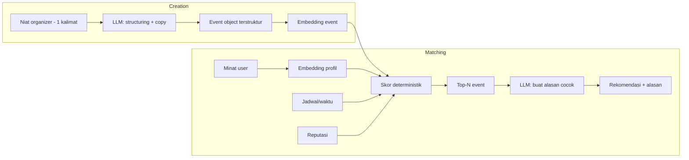
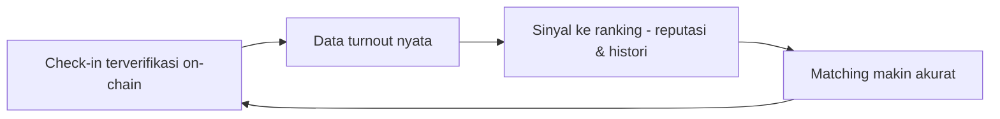

# Ramai — AI Architecture

AI di Ramai punya **dua fungsi nyata** yang meningkatkan produk, bukan chatbot tempelan:

1. **Event Creation Assistant** — niat organizer → event terstruktur + copy.
2. **Participant Matching (explainable)** — cocokkan event ke user + jelaskan alasannya.

Prinsip kunci: **ranking deterministik, LLM hanya menjelaskan.** Ini menjaga hasil stabil, murah, dan tahan manipulasi/prompt-injection.

---

## Diagram



---

## 1. Event Creation Assistant

**Input:** satu kalimat, mis. _"Futsal santai di Yogyakarta buat pemula, Sabtu sore."_

**Output terstruktur (JSON):**
```json
{
  "title": "Futsal Santai Pemula - Yogyakarta",
  "description": "Main futsal ringan buat yang baru mulai...",
  "category": "olahraga",
  "audience_tags": ["futsal", "pemula", "olahraga santai", "yogyakarta"],
  "suggested_time": "Sabtu sore",
  "invite_copy": "Yuk main futsal santai bareng! Cocok buat pemula..."
}
```

**Desain:**
- LLM dipanggil dengan **structured output** (schema JSON) — bukan free text — supaya bisa langsung dipakai form.
- Teks user diperlakukan sebagai **data**, bukan instruksi (mitigasi prompt injection). LLM tidak punya akses tool dari teks user.
- Organizer selalu bisa **edit** hasil; AI adalah asisten, bukan gerbang wajib.
- `audience_tags` dipakai untuk embedding event → langsung feed ke matching.

---

## 2. Participant Matching (Explainable)

### Skor deterministik

`score = w1 * simMinat + w2 * cocokJadwal + w3 * sinyalReputasi`

- `simMinat` — cosine similarity antara embedding profil user dan embedding event (pgvector).
- `cocokJadwal` — event mendatang; bonus bila tidak bentrok dengan RSVP lain (bila data ada).
- `sinyalReputasi` — boost kecil untuk event dari organizer tepercaya; (future) akses lebih awal untuk peserta reputasi tinggi.
- Bobot `w1..w3` dikonfigurasi; default menekankan `simMinat`.

### Penjelasan oleh LLM

Untuk Top-N event, LLM diberi: minat user (tag) + tag event + kenapa skornya tinggi → menghasilkan **satu kalimat alasan** ("Kamu suka olahraga santai dan biasanya kosong Sabtu — event ini pas").

Penting: LLM **tidak** mengubah urutan/skor. Ia hanya menerjemahkan ranking jadi bahasa manusia. Ini:
- mencegah manipulasi peringkat lewat teks event,
- menjaga biaya rendah (hanya Top-N yang dijelaskan),
- membuat hasil dapat dijelaskan & tepercaya (diferensiasi produk).

---

## Embeddings & Penyimpanan

- **Profil user** di-embed dari tag minat (dan, future, riwayat kehadiran).
- **Event** di-embed dari `title + description + audience_tags`.
- Disimpan di Postgres `pgvector`; index vektor untuk pencarian similarity cepat.
- Re-embed saat minat user atau isi event berubah.

---

## Loop Umpan Balik



Kehadiran nyata (dari on-chain) memperkaya sinyal ranking seiring waktu — inilah keunggulan yang menggulung.

---

## Anti-Abuse AI (opsional, NICE)

- **Quality gate:** LLM/heuristik menandai event spam/duplikat/asal sebelum masuk discovery.
- **Batas manipulasi:** karena skor deterministik, "keyword stuffing" di deskripsi event tidak menaikkan peringkat secara semantik berlebihan; embedding menangkap makna, bukan sekadar kata kunci.

---

## Model & Biaya

- LLM: model Claude terbaru yang sesuai untuk structuring + explain (mis. kelas Sonnet untuk keseimbangan biaya/kualitas). Final saat implementasi.
- Embeddings: model embedding standar; dimensi disimpan di pgvector.
- Biaya ditekan dengan: structured output ringkas, hanya Top-N dijelaskan, caching hasil ranking discovery.

> Tidak ada klaim performa AI palsu. Kualitas matching akan diukur nyata pasca-implementasi.
