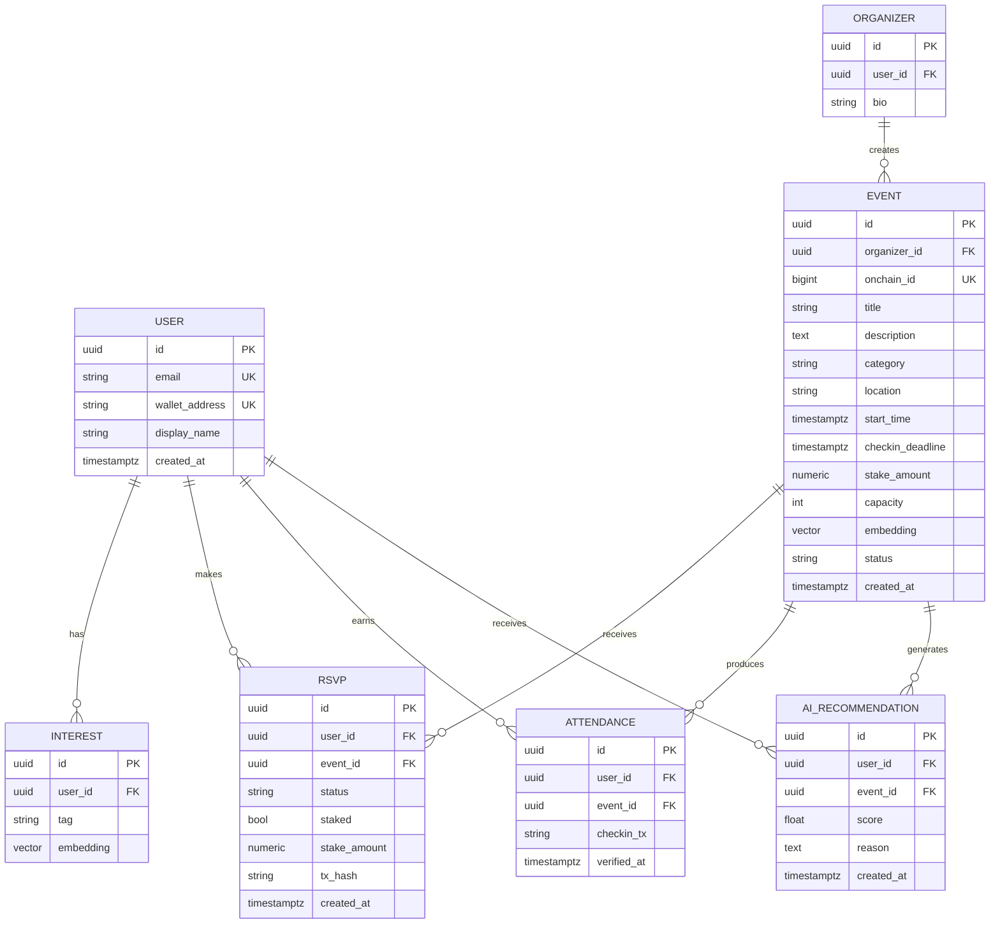

# Ramai — Database Schema

Postgres (Supabase) + `pgvector`. Off-chain menyimpan semua data kaya & privat; on-chain hanya state komitmen minimal. `EVENT.onchain_id` menautkan baris DB ke kontrak.

## ERD

## Entitas & Kunci

| Tabel | PK | FK | Index penting |
|---|---|---|---|
| `USER` | `id` | — | `email` (unik), `wallet_address` (unik) |
| `ORGANIZER` | `id` | `user_id → USER` | `user_id` |
| `INTEREST` | `id` | `user_id → USER` | vektor `embedding` (ivfflat/hnsw), `user_id` |
| `EVENT` | `id` | `organizer_id → ORGANIZER` | `category`, `start_time`, `status`, `onchain_id` (unik), vektor `embedding` |
| `RSVP` | `id` | `user_id`, `event_id` | unik (`user_id`,`event_id`), `status` |
| `ATTENDANCE` | `id` | `user_id`, `event_id` | unik (`user_id`,`event_id`) |
| `AI_RECOMMENDATION` | `id` | `user_id`, `event_id` | (`user_id`,`score` desc) |

## Relasi

- `USER 1—N INTEREST`, `USER 1—N RSVP`, `USER 1—N ATTENDANCE`.
- `ORGANIZER 1—N EVENT` (organizer adalah user dengan peran).
- `EVENT 1—N RSVP`, `EVENT 1—N ATTENDANCE`.
- `RSVP` unik per (user,event); `ATTENDANCE` unik per (user,event).

## Sinkronisasi On-chain

- `RSVP.tx_hash` & `RSVP.status` diperbarui indexer dari event `Joined`/`RSVPCancelled`/`Settled`.
- `ATTENDANCE` dibuat indexer dari event `CheckedIn`.
- Reputasi tidak disimpan sebagai sumber kebenaran di DB — dibaca dari kontrak (`reputationOf`) atau di-cache dari `AttendanceRecorded` untuk tampilan cepat.

## Privasi

- **PII (email, nama)** hanya di DB, tidak pernah on-chain.
- **Embedding minat** off-chain; tidak diekspos ke publik/on-chain.
- **Lokasi presisi** off-chain; on-chain tidak menyimpan lokasi.
- Baris `AI_RECOMMENDATION` bersifat internal (bisa di-purge berkala).
- Terapkan row-level security (Supabase RLS) agar user hanya baca datanya sendiri; data organizer event hanya untuk organizer terkait.

## Catatan

- `stake_amount` di DB adalah cache tampilan; sumber kebenaran nilai stake ada di kontrak.
- `status` EVENT: `draft | active | ended | cancelled`.
- `status` RSVP: `joined | checked_in | settled | cancelled` (mirror state kontrak).
