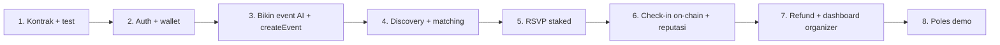

# Ramai — Development Roadmap

Rencana build per fase. Kompleksitas: S (kecil) / M (sedang) / L (besar). Setiap fase punya acceptance criteria.

## Critical Path (jalur tersingkat ke demo meyakinkan)

**Blockers:** kontrak harus jadi & teruji sebelum RSVP/check-in bisa diintegrasi. Embedded wallet harus jalan sebelum semua alur on-chain user.

---

## Fase 1 — Fondasi
| Task | Dep | Kompleksitas | Acceptance |
|---|---|---|---|
| Setup repo (Next.js, Tailwind, shadcn) | — | S | App shell jalan lokal |
| Skema DB + migrasi (Supabase + pgvector) | — | M | Tabel USER/EVENT/RSVP/dll ada |
| Env & konfigurasi | — | S | `.env.local` terbaca, RPC testnet OK |

## Fase 2 — Smart Contract
| Task | Dep | Kompleksitas | Acceptance |
|---|---|---|---|
| `RamaiEvents` (create/join/cancel/checkIn/claim/settle) | F1 | L | Semua fungsi ada + event log |
| `RamaiReputation` (recordAttendance/reputationOf) | F1 | M | Reputasi naik saat check-in |
| Foundry tests (happy + edge + invarian) | atas | L | Test hijau; reentrancy & double-spend tertutup |
| Deploy ke BSC Testnet | atas | S | Alamat tersimpan, verified |

## Fase 3 — Backend
| Task | Dep | Kompleksitas | Acceptance |
|---|---|---|---|
| API CRUD event | F1 | M | Event tersimpan + onchain_id |
| Indexer event on-chain → DB | F2 | M | RSVP/attendance ter-mirror di DB |
| Relay check-in | F2 | M | Check-in via relay sukses, verifikasi sig |

## Fase 4 — AI
| Task | Dep | Kompleksitas | Acceptance |
|---|---|---|---|
| Event creation (structured output) | F3 | M | 1 kalimat → event JSON valid |
| Embeddings profil & event | F1 | M | Vektor tersimpan di pgvector |
| Ranking deterministik + LLM explain | atas | M | Discovery mengembalikan Top-N + alasan |

## Fase 5 — Frontend
| Task | Dep | Kompleksitas | Acceptance |
|---|---|---|---|
| Auth email + embedded wallet | F1 | M | Login email → wallet otomatis |
| Onboarding minat | F4 | S | Minat tersimpan + embedding |
| Discovery + detail event | F4 | M | List ranking + alasan tampil |
| RSVP (gratis + staked) | F2,F5 | M | joinEvent sukses, status update |
| Check-in UI (QR/kode) | F3 | M | Peserta check-in, kehadiran tampil |
| Dashboard organizer | F3 | M | Guest list, check-in, no-show |

## Fase 6 — Integrasi
| Task | Dep | Kompleksitas | Acceptance |
|---|---|---|---|
| End-to-end: create→RSVP→check-in→refund→reputasi | F1–F5 | L | Satu alur penuh jalan di testnet |
| Refund + settle no-show | F2,F5 | M | Stake balik saat hadir; hangus saat no-show |

## Fase 7 — Testing
| Task | Dep | Kompleksitas | Acceptance |
|---|---|---|---|
| Test kontrak final | F6 | M | Semua test hijau |
| Uji alur UX (empty/error/loading) | F6 | M | State tertangani rapi |
| Uji di device mobile | F6 | S | Mobile-first mulus |

## Fase 8 — Demo
| Task | Dep | Kompleksitas | Acceptance |
|---|---|---|---|
| Data seed demo (event & user contoh) | F6 | S | Demo tanpa data kosong |
| Rekaman + naskah demo ≤5 menit | F7 | S | Sesuai [DEMO_SCRIPT.md](./DEMO_SCRIPT.md) |
| Submission copy + README final | F7 | S | Konsisten dengan arsitektur final |

## Prioritas
- **HIGH:** Fase 1–6 (tanpa ini tak ada demo).
- **LOW (kalau sempat):** anti-spam AI, waitlist, reputasi organizer.
- **JANGAN:** token, DAO, NFT marketplace, chat, multi-chain.
