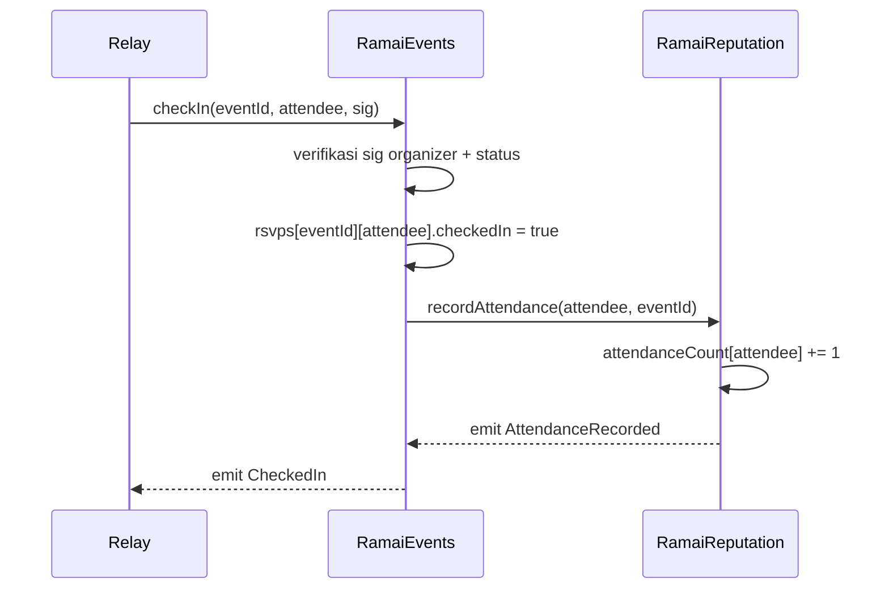

# Ramai — Smart Contract Specification

Dua kontrak, sengaja ramping agar bisa diaudit dalam waktu hackathon. Target: BNB Smart Chain (Testnet untuk demo). Solidity + Foundry.

Prinsip: **on-chain hanya menyimpan state komitmen + kehadiran + reputasi minimal.** Tidak ada PII, deskripsi, atau media on-chain.

---

## Yang TIDAK BOLEH on-chain

Data profil, email, nama, vektor minat, embedding AI, deskripsi/media event, lokasi presisi, kontak. On-chain hanya: ID event, aturan stake/waktu/kapasitas, status RSVP, flag kehadiran, counter reputasi. Metadata dikaitkan lewat `onchain_id` di DB, atau hash bila perlu integritas.

---

## Kontrak 1: `RamaiEvents`

Registry event + escrow stake RSVP + check-in.

### Struct

```solidity
struct Event {
    address organizer;
    uint256 stakeAmount;      // 0 = event gratis
    uint64  startTime;
    uint64  checkInDeadline;  // batas check-in & batas cancel-refund
    uint32  capacity;         // 0 = tanpa batas
    uint32  joinedCount;
    bool    active;
    address forfeitTo;        // tujuan stake no-show (organizer / pool)
}

struct RSVP {
    bool    joined;
    bool    checkedIn;
    bool    settled;          // refund atau forfeit sudah diproses
    uint256 staked;
}
```

### State

```solidity
uint256 public nextEventId;
mapping(uint256 => Event) public events;
mapping(uint256 => mapping(address => RSVP)) public rsvps;
address public reputation;    // alamat RamaiReputation
address public relay;         // relay tepercaya untuk check-in (opsional)
```

### Events (log)

```solidity
event EventCreated(uint256 indexed eventId, address indexed organizer, uint256 stakeAmount, uint64 startTime, uint64 checkInDeadline, uint32 capacity);
event Joined(uint256 indexed eventId, address indexed user, uint256 staked);
event RSVPCancelled(uint256 indexed eventId, address indexed user, uint256 refunded);
event CheckedIn(uint256 indexed eventId, address indexed user);
event RefundClaimed(uint256 indexed eventId, address indexed user, uint256 amount);
event Settled(uint256 indexed eventId, uint256 totalForfeited, uint32 noShowCount);
```

### Fungsi

| Fungsi | Tujuan | Parameter | Return | Emits | Akses | Catatan keamanan |
|---|---|---|---|---|---|---|
| `createEvent` | Daftarkan event + aturan | `stakeAmount, startTime, checkInDeadline, capacity, forfeitTo` | `eventId` | `EventCreated` | siapa saja (jadi organizer) | Validasi waktu: `startTime < checkInDeadline`; `checkInDeadline > now` |
| `joinEvent` | RSVP + escrow stake | `eventId` (payable) | — | `Joined` | siapa saja | `msg.value == stakeAmount`; cek `active`, kapasitas, belum joined, sebelum deadline |
| `cancelRSVP` | Batal + refund stake | `eventId` | — | `RSVPCancelled` | pemilik RSVP | Hanya sebelum `checkInDeadline`; pull refund; set `settled` |
| `checkIn` | Konfirmasi hadir | `eventId, attendee, sig` | — | `CheckedIn` | organizer / relay (verifikasi sig organizer) | Cek `joined && !checkedIn`; sebelum/di deadline; panggil `recordAttendance` |
| `claimRefund` | Ambil stake setelah hadir | `eventId` | — | `RefundClaimed` | attendee | Cek `checkedIn && !settled`; CEI + `nonReentrant`; set `settled` sebelum transfer |
| `settleNoShows` | Hanguskan stake no-show | `eventId, attendees[]` | — | `Settled` | organizer | Setelah `checkInDeadline`; untuk `joined && !checkedIn && !settled` → transfer ke `forfeitTo`; set `settled` |
| `setRelay` | Set relay tepercaya | `relay` | — | — | owner | Opsional; untuk gas abstraction check-in |
| `setReputation` | Set alamat reputasi | `reputation` | — | — | owner | Sekali saat setup |

### Kontrol Akses

- `checkIn`: dipanggil oleh `relay` (yang memverifikasi signature organizer off-chain) **atau** langsung oleh `organizer` event tersebut. Kontrak memastikan pemanggil adalah organizer atau relay resmi.
- `settleNoShows`: hanya `organizer` event.
- Admin (`setRelay`, `setReputation`): `owner` (mis. `Ownable`).

### Pertimbangan Keamanan

- **Reentrancy:** semua transfer keluar (`cancelRSVP`, `claimRefund`, `settleNoShows`) pakai checks-effects-interactions + `nonReentrant`. Refund model **pull** (peserta klaim sendiri) untuk `claimRefund`.
- **Double-spend RSVP/refund:** flag `joined`, `checkedIn`, `settled` mencegah aksi ganda.
- **Signature replay (check-in):** signature check-in mengikat `(eventId, attendee, nonce/deadline)` dan dicek unik.
- **Griefing organizer (tak pernah check-in):** dibatasi oleh `checkInDeadline`; mitigasi produk = check-in dua sisi + reputasi organizer (future). Lihat [SECURITY.md](./SECURITY.md).
- **`settleNoShows` batch besar:** proses per-array dengan batas panjang untuk hindari gas limit.

### Upgradeability & Darurat

- Hackathon: **non-upgradeable** (lebih aman & simpel). 
- Fungsi darurat opsional: `pause()` (Pausable) untuk hentikan `joinEvent` bila ada bug; refund/claim tetap boleh saat paused agar dana tak terkunci.

---

## Kontrak 2: `RamaiReputation`

Reputasi kehadiran **soulbound** (non-transferable), gaya minimal ERC-5192 (token terkunci) atau sekadar counter + SBT opsional.

### State

```solidity
mapping(address => uint256) public attendanceCount;   // reputasi = jumlah hadir terverifikasi
address public events;                                 // hanya RamaiEvents boleh menulis
```

### Events

```solidity
event AttendanceRecorded(address indexed user, uint256 indexed eventId, uint256 newCount);
```

### Fungsi

| Fungsi | Tujuan | Parameter | Akses | Catatan |
|---|---|---|---|---|
| `recordAttendance` | +1 reputasi saat check-in terverifikasi | `user, eventId` | hanya `RamaiEvents` | Idempoten per (user,event) opsional |
| `reputationOf` | Baca skor | `user` → `uint256` | view | Dipakai matching & organizer |
| `setEvents` | Set alamat RamaiEvents | `events` | owner | Sekali saat setup |

### Soulbound

- Jika diimplementasikan sebagai token: override transfer agar selalu revert (locked), sesuai semangat ERC-5192.
- Untuk MVP demo cukup counter `attendanceCount` yang hanya bisa ditulis `RamaiEvents` — sudah non-transferable secara desain (tak ada fungsi transfer).

---

## Alur Antar-Kontrak (Check-in)



---

## Rencana Test (Foundry)

- `createEvent`: validasi waktu, event tersimpan, log benar.
- `joinEvent`: stake benar, tolak nilai salah, tolak setelah deadline, tolak kapasitas penuh, tolak double join.
- `cancelRSVP`: refund sebelum deadline, tolak setelah deadline.
- `checkIn`: hanya organizer/relay, tolak double check-in, reputasi naik, tolak sig invalid/replay.
- `claimRefund`: hanya setelah check-in, tolak double claim, reentrancy guard.
- `settleNoShows`: forfeit hanya no-show, tolak sebelum deadline, tolak double settle.
- Invarian: total dana masuk == total refund + forfeit + saldo tersisa.
