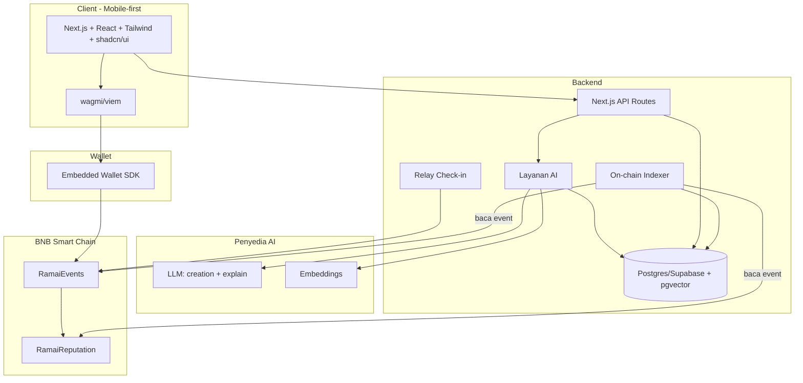

# Ramai — Technical Architecture

## Prinsip

1. **On-chain hanya untuk yang butuh trust** (escrow stake, kehadiran, reputasi). Sisanya off-chain.
2. **Off-chain untuk yang berat/privat/cepat** (profil, minat, embedding, pencarian, media).
3. **Blockchain tak terlihat** untuk alur inti user (embedded wallet, tanpa gas prompt).
4. **Index balik** event on-chain ke Postgres supaya UI tetap cepat & bisa di-query.

## Diagram Sistem

## Alur Data Kunci

### A. Bikin event
`Organizer intent → LLM (structuring) → draft → organizer edit → createEvent() on-chain → EventCreated → indexer → simpan event + onchain_id + embedding di DB`

### B. Discovery
`User buka discovery → API ambil event aktif dari DB → ranking (vector similarity + jadwal + reputasi) → LLM buat alasan → kirim ke UI`

### C. RSVP staked
`UI → embedded wallet → joinEvent{value} on-chain → Joined event → indexer → update RSVP di DB`

### D. Check-in
`Organizer scan QR → relay verifikasi sig → checkIn() on-chain → RamaiEvents memanggil RamaiReputation.recordAttendance() → indexer → update kehadiran + reputasi di DB`

## Tech Stack & Alasan

| Lapisan | Teknologi | Alasan |
|---|---|---|
| Frontend | Next.js, React, Tailwind, shadcn/ui | Cepat, mobile-first, komponen siap pakai |
| Auth/Wallet | Embedded wallet SDK (mis. Privy/Web3Auth) | Login email → wallet otomatis, tanpa seed phrase |
| Backend | Next.js API routes | Satu repo, cepat rilis; cukup untuk skala hackathon |
| DB | Postgres/Supabase + pgvector | Relasional + vektor embedding di satu tempat, hosting mudah |
| AI | LLM + model embedding | Creation + matching + alasan |
| Chain client | viem + wagmi | Type-safe, integrasi wallet & React hooks |
| Kontrak | Solidity + Foundry | Test cepat, deploy skrip terkontrol |
| Chain | BNB Smart Chain Testnet (opBNB opsional) | Fee rendah untuk micro-stake, tooling EVM |
| Indexer | Skrip pemantau event (viem `watchEvent`) atau layanan indexer | Sinkron state on-chain ke DB |

> Pemilihan SDK embedded wallet & penyedia LLM final ditentukan saat implementasi; blueprint agnostik selama memenuhi: login email → wallet, dan tanda tangan tx tanpa friksi.

## Komponen Backend

- **API Routes** — CRUD event, RSVP read model, profil, discovery.
- **Layanan AI** — dua fungsi: `structureEvent(intent)` dan `rankAndExplain(userId)`.
- **Indexer** — dengarkan `EventCreated`, `Joined`, `CheckedIn`, `RSVPCancelled`, `Settled`, `AttendanceRecorded`; tulis ke DB.
- **Relay check-in** — terima permintaan check-in ber-signature organizer, kirim tx `checkIn` (menyembunyikan gas dari organizer). Fallback: organizer tanda tangan langsung.

## Strategi Wallet & Gas

- **Embedded wallet** untuk peserta & organizer → login email, kunci dikelola SDK.
- **Gas abstraction:** untuk demo, relay bisa membayar gas check-in; RSVP stake tetap dari user (nilai stake ≠ gas). Untuk mainnet, evaluasi paymaster/relayer.
- **Testnet:** tBNB dari faucet; UI memandu top-up bila saldo kurang.

## Lingkungan & Konfigurasi

Lihat env vars di [README](../README.md#environment-variables). Rahasia (private key deploy, API key) tidak pernah di client; hanya di server/backend.

## Skalabilitas (arah pasca-hackathon)

- Pindah indexer ke layanan khusus (mis. subgraph/hosted indexer).
- Cache ranking (Redis) untuk discovery panas.
- Pindah ke opBNB untuk biaya tx lebih rendah pada skala.
- Pisahkan layanan AI jika beban embedding tinggi.
