# Ramai — User Flows

Dokumen ini memuat **semua alur** produk Ramai: happy path, alur on-chain, dan edge case. Semua diagram konsisten dengan [PRODUCT_SPEC.md](./PRODUCT_SPEC.md), [SMART_CONTRACT_SPEC.md](./SMART_CONTRACT_SPEC.md), dan [TECHNICAL_ARCHITECTURE.md](./TECHNICAL_ARCHITECTURE.md).

Dua peran utama:
- **Peserta (Participant)** — mencari, RSVP, hadir, mengumpulkan reputasi.
- **Organizer** — membuat event, mengisi, check-in, menyelesaikan no-show.

Legenda status RSVP: `JOINED` → `CHECKED_IN` → `SETTLED` (atau `CANCELLED`).

---

## 0. Peta Alur (High-Level)

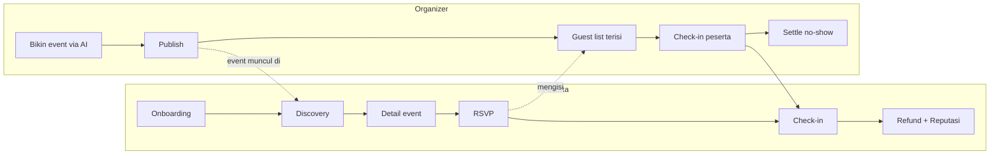

---

## 1. Onboarding & Wallet (Peserta)

Tujuan: user non-crypto masuk tanpa tahu apa itu wallet.

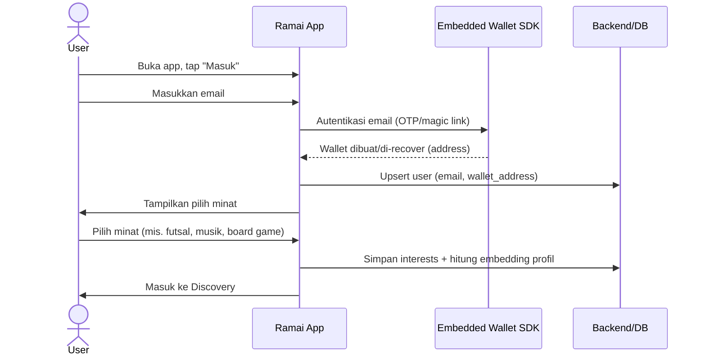

Catatan UX:
- Kata "wallet", "gas", "seed phrase" **tidak** muncul di alur ini.
- Wallet dibuat di background; user hanya lihat "akun kamu siap".

Edge case:
- **Email sudah terdaftar** → langsung recover wallet, skip pilih minat.
- **SDK wallet gagal** → tampilkan retry; jangan blokir user dengan error teknis.

---

## 2. Discovery & AI Matching (Peserta)

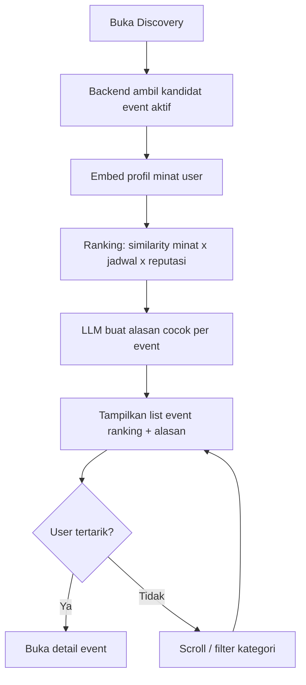

Detail ranking (deterministik, lihat [AI_ARCHITECTURE.md](./AI_ARCHITECTURE.md)):
- **Similarity minat** — cosine antara embedding profil dan embedding event.
- **Kecocokan jadwal** — event mendatang & tidak bentrok jika data ada.
- **Reputasi** — event dari organizer tepercaya sedikit di-boost; peserta reputasi tinggi bisa dapat akses lebih awal (future).
- LLM **hanya** menjelaskan, tidak mengubah skor (mitigasi manipulasi & prompt injection).

Edge case:
- **User baru tanpa cukup minat** → fallback ke event populer/terdekat + prompt lengkapi minat.
- **Tidak ada event cocok** → empty state: "Belum ada yang pas — coba minat lain / buat event sendiri".

---

## 3. Organizer Bikin Event via AI

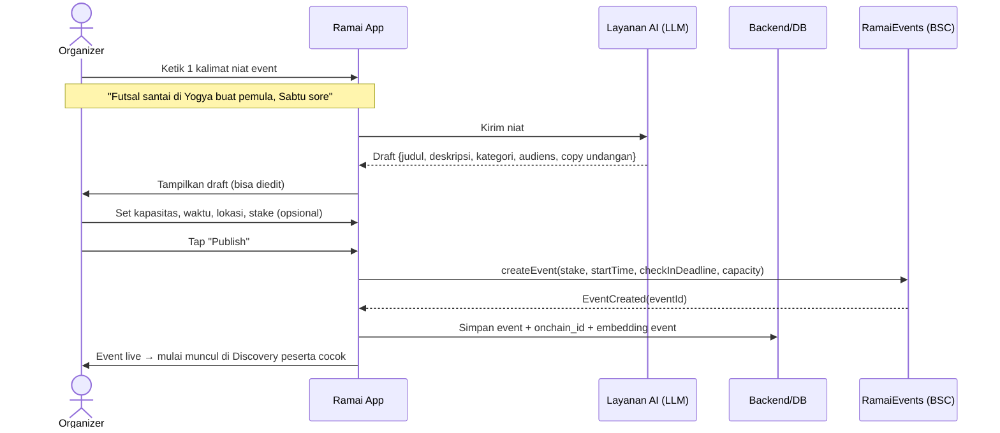

Keputusan desain:
- Metadata kaya (deskripsi, media, lokasi presisi) **off-chain**; on-chain hanya aturan komitmen + ID.
- Stake **opsional** — organizer bisa bikin event gratis (RSVP tanpa stake) atau berkomitmen (dengan stake).

Edge case:
- **Output AI aneh/kosong** → organizer tetap bisa isi manual; AI adalah asisten, bukan gerbang wajib.
- **Tx createEvent gagal** → event disimpan sebagai draft off-chain, tombol "coba publish lagi".

---

## 4. RSVP — Gratis vs Stake (Peserta)

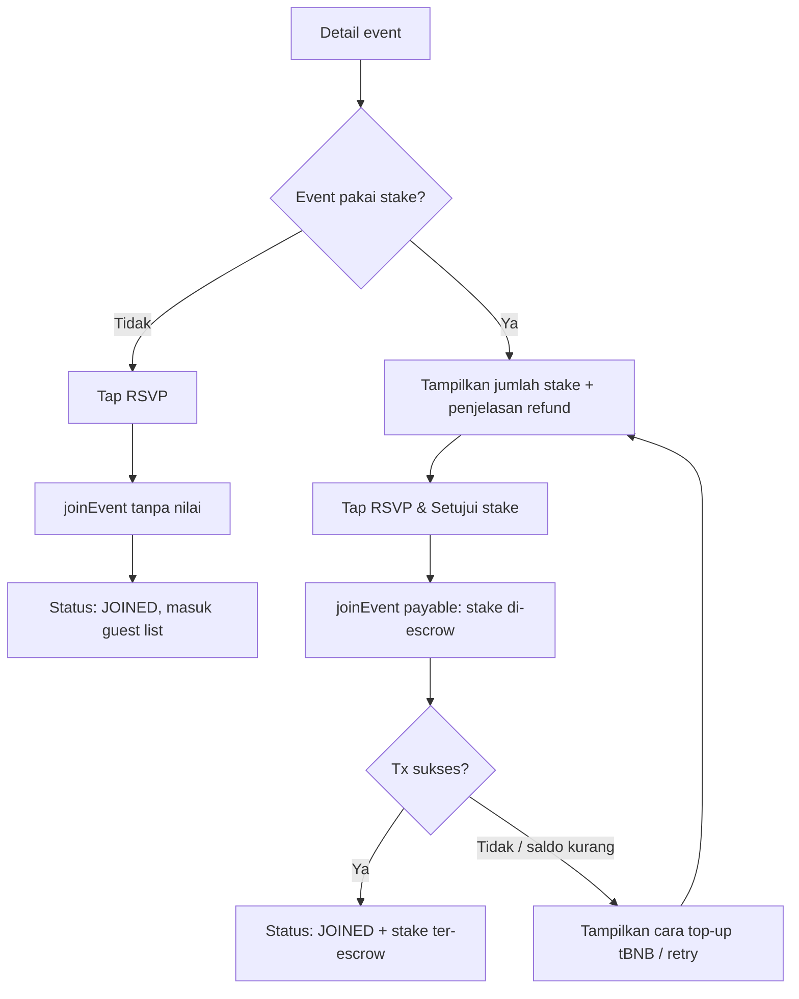

Sequence untuk staked RSVP:

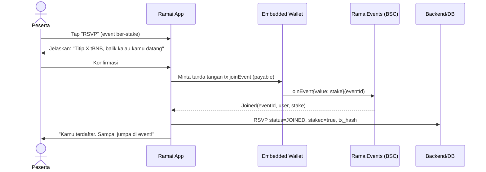

Catatan UX:
- Untuk embedded wallet, tanda tangan tx bisa dibuat **satu tap** tanpa popup gas ala MetaMask.
- Copy fokus manfaat ("balik kalau datang"), bukan istilah "escrow/stake".

Edge case:
- **Kapasitas penuh** → tombol RSVP jadi "Waitlist" (future) atau nonaktif.
- **Deadline RSVP lewat** → RSVP ditutup.

---

## 5. Batal RSVP (Cancel)

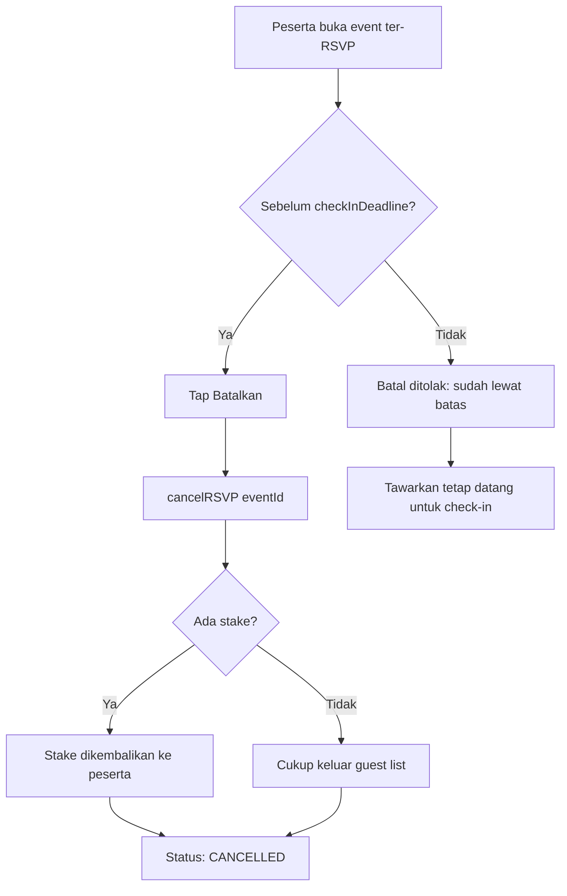

Aturan: pembatalan sebelum `checkInDeadline` mengembalikan stake penuh (mengurangi risiko orang takut nyangkut). Setelah deadline, hanya check-in yang mengembalikan stake.

---

## 6. Check-in & Konfirmasi On-chain

Model trust: organizer menandatangani konfirmasi kehadiran; relay/backend memverifikasi lalu menulis on-chain. (Peningkatan dua-sisi ada di [Batasan](../README.md#batasan-yang-diketahui).)

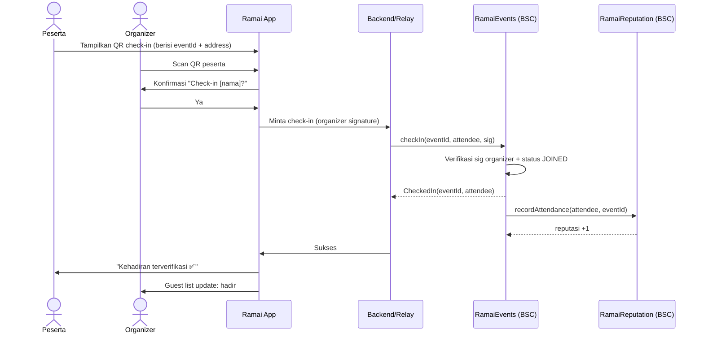

Alur alternatif check-in (kode 6 digit, tanpa QR):

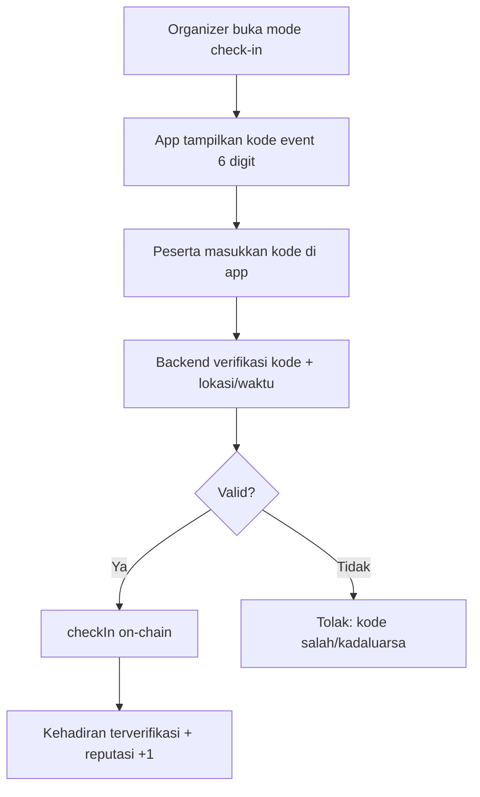

Edge case:
- **Peserta belum RSVP tapi datang** → organizer bisa "RSVP + check-in" sekaligus (event gratis) atau minta RSVP dulu (event ber-stake).
- **Double check-in** → ditolak oleh flag `checkedIn` di kontrak.
- **Relay down** → fallback: organizer tanda tangan langsung dari wallet organizer.

---

## 7. Refund Stake & Reputasi (Peserta)

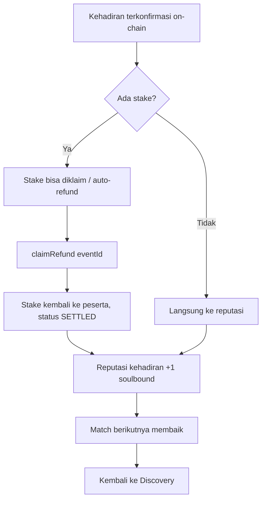

Catatan:
- Refund bisa **pull-based** (`claimRefund` oleh peserta, aman dari reentrancy) atau di-batch oleh organizer saat settle; blueprint memakai pull untuk keamanan.
- Reputasi ditulis oleh `RamaiEvents` ke `RamaiReputation` saat check-in, jadi naik walau stake belum diklaim.

---

## 8. Settle No-Show (Organizer)

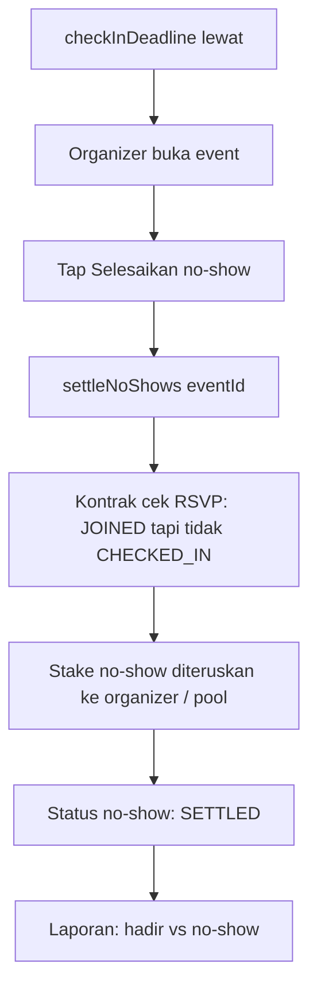

Sequence:

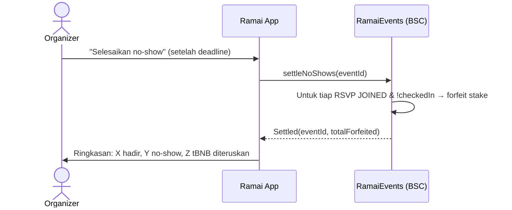

Kebijakan forfeit (dapat dikonfigurasi per event):
- **Ke organizer** — kompensasi kursi kosong. (default demo)
- **Ke pool / dibakar** — anti-abuse organizer. (future)

Edge case:
- **Organizer sengaja tak pernah check-in** (griefing) → peserta tetap punya jalur `claimRefund` bila terbukti hadir? Tidak — karena bukti hadir butuh sig organizer. Mitigasi: check-in dua sisi (future) + reputasi organizer. Lihat [SECURITY.md](./SECURITY.md).

---

## 9. Loop Reputasi (Sistem)

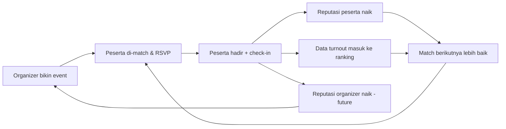

Ini core loop yang compounding: makin banyak check-in jujur → matching makin akurat → event makin keisi orang yang tepat.

---

## 10. Ringkasan State RSVP

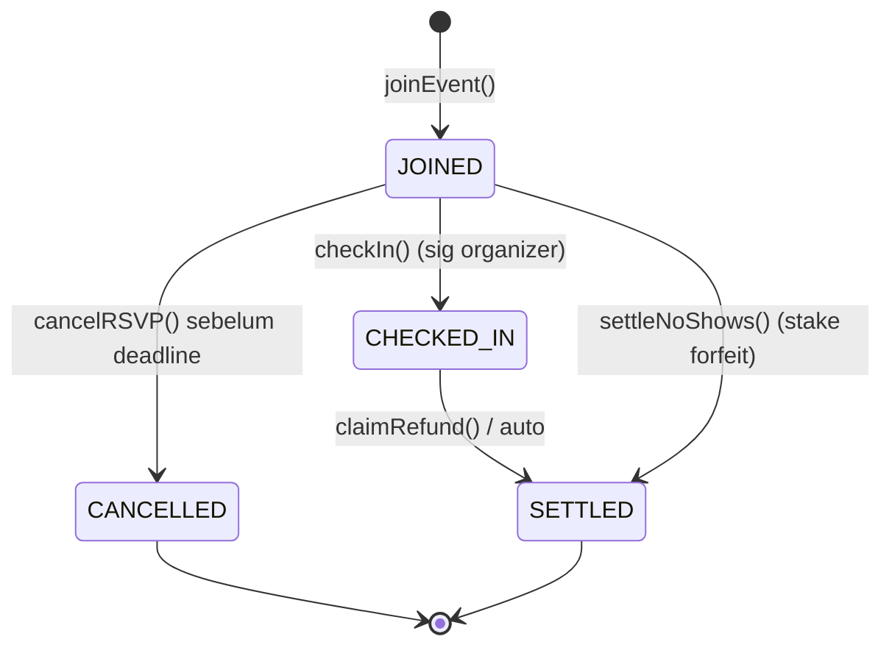

| State | Arti | Stake |
|---|---|---|
| `JOINED` | Terdaftar, belum hadir | Ter-escrow |
| `CHECKED_IN` | Hadir, terverifikasi on-chain | Ter-escrow, siap refund |
| `SETTLED` | Selesai (refund atau forfeit) | Sudah dilepas |
| `CANCELLED` | Batal sebelum deadline | Dikembalikan |

---

## 11. Peta Empty / Error / Loading State (UX)

| Kondisi | State | Perilaku |
|---|---|---|
| Belum ada minat | Empty | Prompt pilih minat, tampilkan event populer |
| Tidak ada match | Empty | "Belum ada yang pas" + CTA buat event |
| Tx pending | Loading | Skeleton + "menyimpan RSVP kamu…" (tanpa istilah gas) |
| Tx gagal | Error | Pesan ramah + retry; detail teknis di log |
| Saldo tBNB kurang | Error | Panduan top-up faucet (testnet) |
| Relay down | Degraded | Fallback tanda tangan organizer langsung |
| Kapasitas penuh | Info | Tombol jadi nonaktif / waitlist (future) |
| RSVP ditutup | Info | "Pendaftaran sudah ditutup" |
